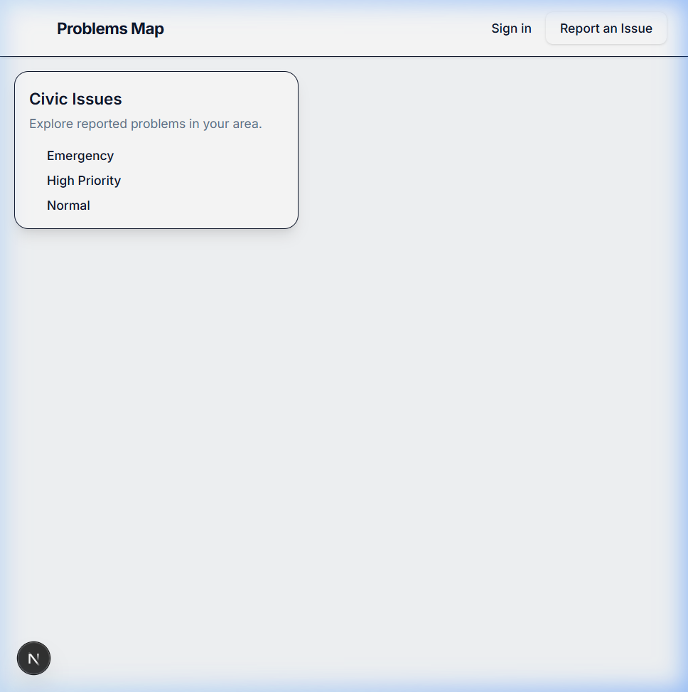
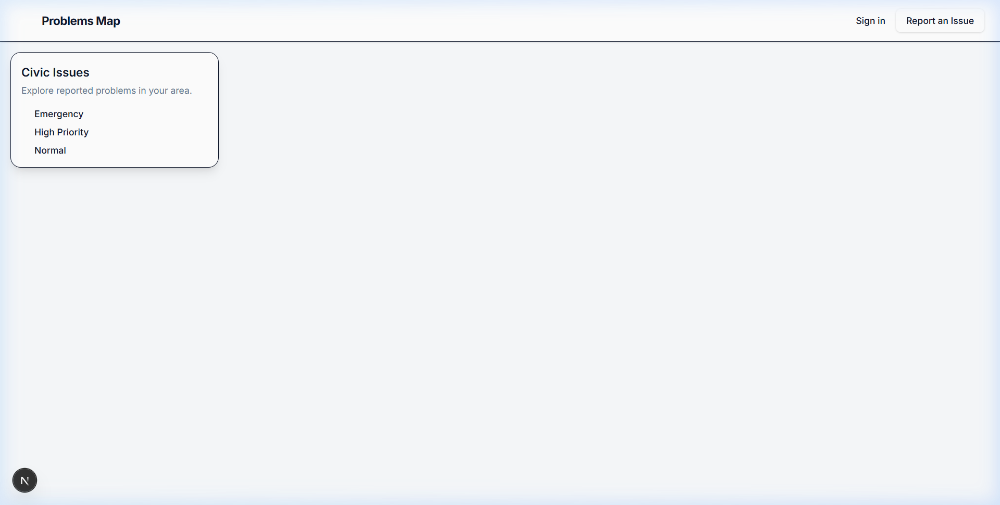
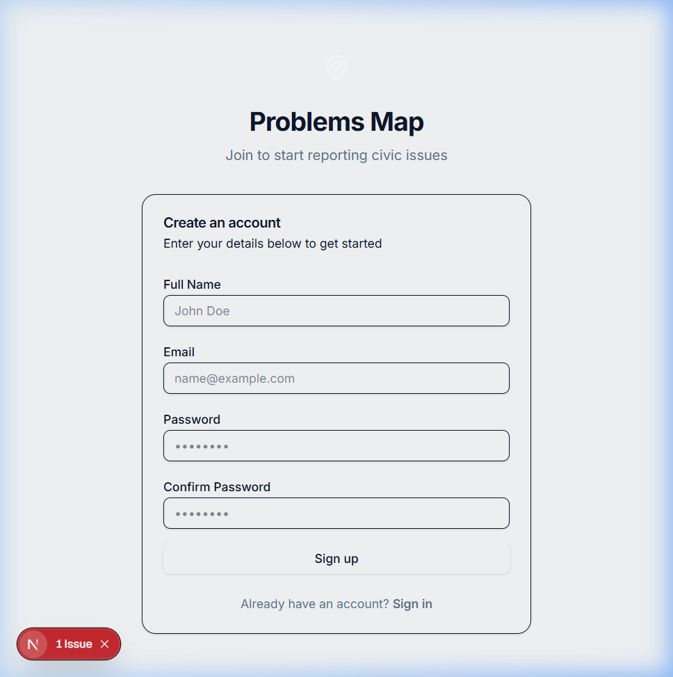
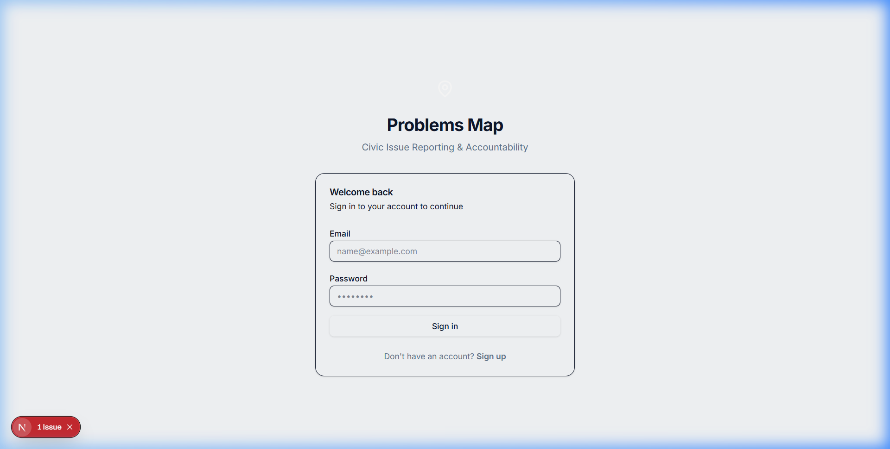

# Problems Map

**See the problem. Track the action. Prove the resolution.**

Problems Map is a civic accountability and infrastructure reporting platform. It provides location-authenticated reporting, structured civic issue records, and a transparent workflow from initial report to official resolution.

This is a production-ready application featuring clean architecture, real database persistence, strict role-based authorization, and auditable history tracking. It is built as a zero-budget MVP architecture capable of scaling without requiring a complete rewrite.

## Visual Showcase


*Full platform demonstration from citizen report to official resolution.*

### Core Interfaces

| Landing Page | Interactive Public Map |
|:---:|:---:|
|  |  |

| Citizen Registration | Secure Login |
|:---:|:---:|
|  |  |

---

## 1. Product Vision

Problems Map is designed as a civic accountability platform, not a social media clone. 

The core lifecycle is:
`REPORT -> VERIFY -> CLASSIFY -> DETECT DUPLICATE -> ROUTE -> ASSIGN -> ACKNOWLEDGE -> WORK IN PROGRESS -> RESOLUTION SUBMITTED -> RESOLUTION VERIFIED -> RESOLVED -> AUDITABLE HISTORY`

### Key Differentiators
1. Location-authenticated reporting with device GPS.
2. Structured civic issue records preventing duplicate chaos.
3. Persistent issue history and transparent workflow tracking.
4. Automatic department assignment based on rules.
5. Strict resolution evidence submission for officials.
6. Append-only auditable history.
7. Community prioritization and voting.
8. Duplicate issue clustering around a Master Issue.
9. Administrative and SLA analytics.

---

## 2. Technology Stack

- **Framework:** Next.js (App Router)
- **Language:** TypeScript
- **Database:** PostgreSQL (Supabase)
- **Spatial Engine:** PostGIS
- **Authentication:** Supabase Auth
- **Storage:** Supabase Storage (Evidence & Media)
- **Security:** Row Level Security (RLS)
- **Map:** MapLibre GL JS (OpenStreetMap-compatible)
- **Styling:** Tailwind CSS & shadcn/ui
- **Validation:** Zod & React Hook Form
- **Hosting Target:** Vercel

---

## 3. Core Architecture & Features

### Supabase Integration & Security
- **4-Tier Client Architecture:** Strictly separated clients for Browser, Server, Proxy/Middleware, and Admin service-role execution.
- **Row Level Security (RLS):** Complete enforcement at the database layer. No sensitive data is leaked to the client.
- **Database Triggers:** Automated status history logging, version number increments (optimistic concurrency control), and timestamp management.

### Geospatial Capabilities
- **PostGIS Integration:** Issues are stored using `GEOGRAPHY(POINT, 4326)`.
- **Bounding Box API:** Fast viewport-based spatial queries (`/api/issues/map`) for map rendering without loading the entire state into memory.
- **Client-Side Clustering:** High-performance marker clustering using `supercluster`.

### Civic Reporting Flow
- Mobile-first, strict 3-step reporting wizard.
- Mandatory geolocation requiring valid browser GPS coordinates.
- Direct evidence media upload limits and validation to Supabase Storage.
- Categorization and deduplication logic based on bounding radius.

### Official Government Workflow
- **Roles:** Citizen, Verifier, Officer, MLA, District Admin, State Admin, Super Admin.
- **State Machine UI:** Strict transitions (e.g., `IN_PROGRESS` -> `RESOLUTION_SUBMITTED`).
- **Resolution Verification:** Officers upload before/after photos and work descriptions. Verifiers independently approve or reject the resolution before the issue is closed.
- **Dashboards:** Real-time metrics for pending, action-required, and emergency tasks.

---

## 4. Local Development Setup

### Prerequisites
- Node.js (v18+)
- Supabase CLI (Optional for local testing)

### Installation

1. Clone the repository:
   ```bash
   git clone https://github.com/Navaneethan-P/Problems-Map.git
   cd problems-map
   ```

2. Install dependencies:
   ```bash
   npm install
   ```

3. Setup Environment Variables:
   Create a `.env.local` file and add:
   ```env
   NEXT_PUBLIC_SUPABASE_URL=your-project-url
   NEXT_PUBLIC_SUPABASE_ANON_KEY=your-anon-key
   SUPABASE_SERVICE_ROLE_KEY=your-service-role-key
   ```

4. Run the development server:
   ```bash
   npm run dev
   ```

---

## 5. Supabase Setup & Migrations

If deploying to a fresh Supabase project:
1. Enable the **PostGIS** extension in your Supabase dashboard.
2. Execute the migrations located in `supabase/migrations/` sequentially.
3. Configure your Storage buckets (e.g., `issue_media`) and enable their RLS policies.
4. Execute `supabase/seed.sql` to generate demo roles, categories, departments, and dummy data.

---

## 6. Deployment (Vercel)

The application is optimized for Vercel deployment.

1. Push your code to GitHub.
2. Import the repository into Vercel.
3. Add the required environment variables:
   - `NEXT_PUBLIC_SUPABASE_URL`
   - `NEXT_PUBLIC_SUPABASE_ANON_KEY`
   - `SUPABASE_SERVICE_ROLE_KEY`
4. Deploy.

*Note: The `proxy.ts` (middleware) will automatically protect all `/admin` and `/citizen` routes in production.*

---

## 7. Known Limitations (MVP)

- **Official Integration:** The current application structure does not integrate with actual municipal dispatch systems (e.g., 104 dispatch APIs).
- **Push Notifications:** Notification architecture exists in the database, but real-time SMS/WhatsApp delivery requires a third-party paid API provider (Twilio, Gupshup), which is not configured for the free tier.
- **Administrative Boundaries:** Geographic boundaries (wards, taluks, states) rely on basic point mapping; exact polygon checking requires official government geometry datasets which are not bundled.

---

## 8. Future Roadmap

- **Advanced Duplicate Detection:** Perceptual image hashing to detect if citizens upload the exact same pothole photo.
- **SLA Violation Alerts:** Automated escalation paths when departments fail to resolve issues within the configured timeline.
- **Civic Hotspot Mapping:** Algorithmic detection of systemic failures (e.g., 50 water-logging complaints within a 1km radius).
- **Offline Sync:** Full Service Worker and IndexedDB queue implementation for submission without a data connection.

---

## License

This project is licensed under the MIT License. See the `LICENSE` file for details.
